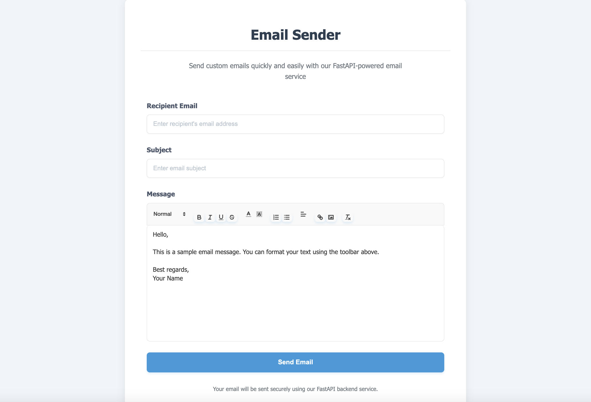

# FastAPI Email Sender with Jinja2 Templates
## Application Interface


A modern web application built with FastAPI that provides an elegant email sending interface with rich text editing capabilities using Quill.js and Jinja2 templating.

## Features

- 🚀 **FastAPI Backend**: High-performance async web framework
- ✉️ **Email Sending**: SMTP integration for reliable email delivery
- 📝 **Rich Text Editor**: Quill.js editor with formatting options
- 🎨 **Modern UI**: Clean, responsive design with CSS styling
- 🔒 **Secure**: Environment variable configuration for credentials
- 📱 **Responsive**: Mobile-friendly interface

## Project Structure

```
fastapi-Jinja2-Email/
├── project/
│   ├── main.py              # FastAPI application entry point
│   ├── .env                 # Environment variables (not in repo)
│   └── app/
│       ├── __init__.py      # App package initialization
│       ├── static/
│       │   └── css/
│       │       └── style.css # Application styles
│       └── templates/
│           ├── index.html   # Email form with Quill editor
│           └── about.html   # About page
├── requirements.txt         # Python dependencies
├── .gitignore              # Git ignore rules
└── README.md               # Project documentation
```

## Setup Instructions

### Prerequisites

- Python 3.8+
- pip package manager

### Installation

1. **Clone the repository:**
   ```bash
   git clone git@github.com:Posuza/Html_Email_Sender-FastApi-Jinja2-.git
   cd fastapi-Jinja2-Email
   ```

2. **Create a virtual environment:**
   ```bash
   python -m venv venv
   source venv/bin/activate  # On Windows: venv\Scripts\activate
   ```

3. **Install dependencies:**
   ```bash
   pip install -r requirements.txt
   ```

4. **Configure environment variables:**
   Create a `.env` file in the `project/` directory:
   ```env
   EMAIL_USERNAME=your_email@gmail.com
   EMAIL_PASSWORD=your_app_password
   SMTP_SERVER=smtp.gmail.com
   SMTP_PORT=587
   ```

5. **Run the application:**
   ```bash
   cd project
   uvicorn main:app --reload
   ```

6. **Access the application:**
   Open your browser and navigate to `http://127.0.0.1:8000`

## Usage

### Sending Emails

1. Navigate to the home page (`http://127.0.0.1:8000`)
2. Fill in the recipient's email address
3. Enter a subject line
4. Compose your message using the rich text editor
5. Click "Send Email" to dispatch your message

### Features Available

- **Rich Text Formatting**: Bold, italic, underline, lists, and more
- **Background Processing**: Emails are sent asynchronously
- **Error Handling**: User-friendly error messages
- **Responsive Design**: Works on desktop and mobile devices

## API Endpoints

- `GET /` - Home page with email form
- `GET /about` - About page
- `POST /send-email` - Send email endpoint (JSON)

## Technologies Used

- **Backend**: FastAPI, Uvicorn, Pydantic
- **Templating**: Jinja2
- **Email**: smtplib, email.mime
- **Frontend**: HTML5, CSS3, JavaScript
- **Rich Text Editor**: Quill.js
- **Styling**: Custom CSS with modern design

## Development

### Running in Development Mode

```bash
uvicorn main:app --reload --host 0.0.0.0 --port 8000
```

### Environment Variables

The application uses the following environment variables:

| Variable | Description | Required |
|----------|-------------|----------|
| `EMAIL_USERNAME` | SMTP username (email address) | Yes |
| `EMAIL_PASSWORD` | SMTP password (app password for Gmail) | Yes |
| `SMTP_SERVER` | SMTP server address | No (defaults to smtp.gmail.com) |
| `SMTP_PORT` | SMTP server port | No (defaults to 587) |

## Security Notes

- Never commit your `.env` file to version control
- Use app-specific passwords for Gmail
- Consider using OAuth2 for production deployments
- Implement rate limiting for production use

## Contributing

1. Fork the repository
2. Create a feature branch (`git checkout -b feature/amazing-feature`)
3. Commit your changes (`git commit -m 'Add amazing feature'`)
4. Push to the branch (`git push origin feature/amazing-feature`)
5. Open a Pull Request

## License

This project is open source and available under the [MIT License](LICENSE).

## Support

If you encounter any issues or have questions, please open an issue on GitHub.
